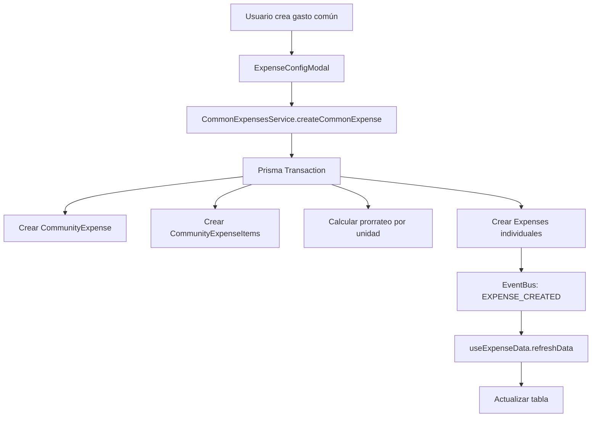
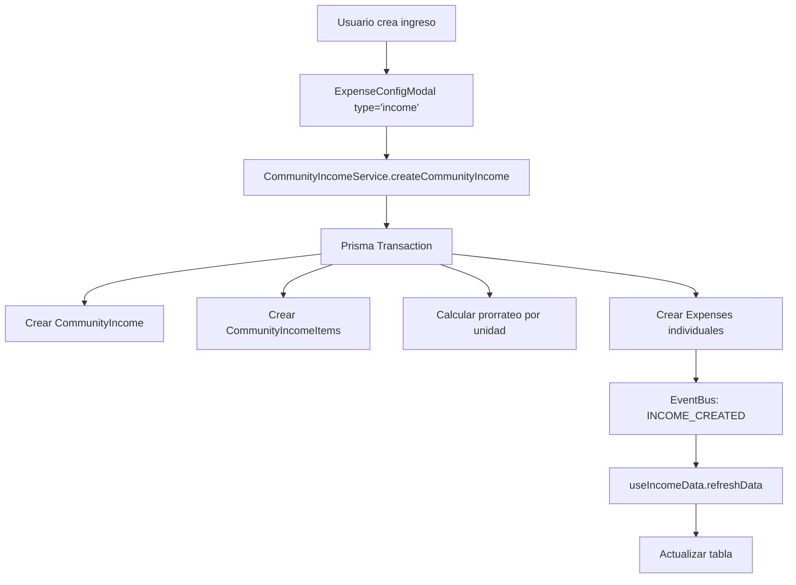
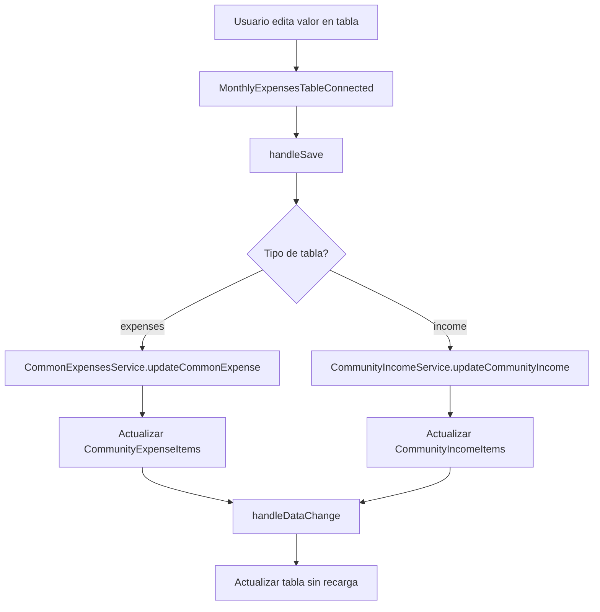

# Reglas de Cursor para el Módulo de Gastos Comunes - Comuniapp

## 📋 Resumen del Módulo

El módulo de **Gastos Comunes** es un sistema completo de gestión financiera que permite a las comunidades administrar tanto **egresos** (gastos comunes) como **ingresos** (ingresos comunitarios) con prorrateo automático por unidades residenciales.

### 🎯 Funcionalidades Principales

#### **Para Administradores:**

- ✅ Gestión de gastos comunes mensuales con prorrateo automático
- ✅ Gestión de ingresos comunitarios con prorrateo automático
- ✅ Selección de método de prorrateo (igualitario o por coeficiente)
- ✅ Configuración de categorías independientes para egresos e ingresos
- ✅ Formularios dinámicos para múltiples ítems
- ✅ Previsualización del prorrateo antes de crear
- ✅ Estadísticas detalladas y balance financiero
- ✅ Tabla unificada con selector de tipo (Egresos/Ingresos)

#### **Para Residentes:**

- ✅ Consulta de gastos personales prorrateados
- ✅ Filtros por estado (todos, pendientes, pagados, vencidos)
- ✅ Estadísticas personales de pagos
- ✅ Información detallada de cada gasto

---

## 🏗️ Arquitectura del Sistema

### **Frontend (Next.js + React)**

#### **1. Página Principal**

**Archivo:** `apps/web/src/app/dashboard/gastos-comunes/page.tsx`

```typescript
// Estructura de la página principal
export default function GastosComunesPage() {
  const { currentCommunity, communities, isLoading: communitiesLoading } = useCommunity();
  const { user } = useAuth();
  const [isConfigModalOpen, setIsConfigModalOpen] = useState(false);
  const [configModalType, setConfigModalType] = useState<'expenses' | 'income'>('expenses');

  return (
    <ProtectedRoute>
      <RoleGuard allowedRoles={['SUPER_ADMIN', 'COMMUNITY_ADMIN', 'RESIDENT']}>
        <DashboardLayout>
          <CommonExpensesDashboard
            communityId={currentCommunity.id}
            onConfigExpenses={() => {
              setConfigModalType('expenses');
              setIsConfigModalOpen(true);
            }}
            onConfigIncome={() => {
              setConfigModalType('income');
              setIsConfigModalOpen(true);
            }}
          />
          <ExpenseConfigModal
            key={`${configModalType}-${currentCommunity.id}`}
            isOpen={isConfigModalOpen}
            onClose={() => {
              setIsConfigModalOpen(false);
              invalidateExpenseCache(currentCommunity.id);
            }}
            communityId={currentCommunity.id}
            type={configModalType}
          />
        </DashboardLayout>
      </RoleGuard>
    </ProtectedRoute>
  );
}
```

#### **2. Componentes Principales**

##### **A. CommonExpensesDashboard**

**Archivo:** `apps/web/src/components/common-expenses/CommonExpensesDashboard.tsx`

**Responsabilidades:**

- Dashboard principal con estadísticas globales
- Cards de resumen financiero (Total Egresos, Total Ingresos, Balance)
- Integración con `MonthlyExpensesTableConnected`
- Manejo de datos de múltiples servicios

**Características Clave:**

```typescript
// Fetch de datos paralelo
const [expensesData, incomesData] = await Promise.all([
  CommonExpenseService.getCommonExpensesByCommunity(communityId),
  CommunityIncomeService.getCommunityIncomes(communityId),
]);

// Cálculo de estadísticas
const expenseStats = expenses.reduce(
  (acc, expense) => {
    const amount = Number(expense.totalAmount) || 0;
    acc.totalExpenses += amount;
    return acc;
  },
  { totalExpenses: 0 },
);

const incomeStats = incomes.reduce(
  (acc, income) => {
    const amount = Number(income.totalAmount) || 0;
    acc.totalIncome += amount;
    return acc;
  },
  { totalIncome: 0 },
);

const balance = incomeStats.totalIncome - expenseStats.totalExpenses;
```

##### **B. MonthlyExpensesTableConnected**

**Archivo:** `apps/web/src/components/common-expenses/MonthlyExpensesTableConnected.tsx`

**Responsabilidades:**

- Tabla unificada para mostrar egresos e ingresos
- Selector de tipo (Egresos/Ingresos)
- Botones de configuración específicos por tipo
- Manejo de valores editables con guardado automático
- Integración con hooks de datos

**Características Clave:**

```typescript
// Estado del tipo de tabla
const [expenseType, setExpenseType] = useState<"expenses" | "income">(
  "expenses",
);

// Función para aplanar items de ingresos
const flattenIncomeItems = useCallback(() => {
  if (expenseType !== "income") return [];

  const flattenedItems: any[] = [];
  incomes.forEach((income) => {
    if (income.items) {
      income.items.forEach((item) => {
        flattenedItems.push({
          id: item.id,
          title: item.name,
          name: item.name,
          amount: item.amount,
          description: item.description,
          categoryId: item.categoryId,
          createdAt: item.createdAt,
          updatedAt: item.updatedAt,
        });
      });
    }
  });
  return flattenedItems;
}, [expenseType, incomes]);

// Lógica de guardado diferenciada por tipo
const handleSave = async () => {
  if (expenseType === "expenses") {
    // Lógica para gastos comunes (CommonExpensesService)
  } else {
    // Lógica para ingresos (CommunityIncomeService)
  }
};
```

##### **C. ExpenseConfigModal**

**Archivo:** `apps/web/src/components/common-expenses/ExpenseConfigModal.tsx`

**Responsabilidades:**

- Modal de configuración para categorías e items
- Soporte para ambos tipos: 'expenses' | 'income'
- Gestión de categorías independientes por tipo
- CRUD completo de items con validación

**Características Clave:**

```typescript
interface ExpenseConfigModalProps {
  isOpen: boolean;
  onClose: () => void;
  communityId: string;
  onDataChange?: () => void;
  type?: "expenses" | "income"; // Tipo de configuración
}

// Carga de categorías filtradas por tipo
const loadCategories = async () => {
  const categoryType = type === "expenses" ? "EXPENSE" : "INCOME";
  const data = await ExpenseCategoriesService.getCategoriesByCommunity(
    communityId,
    categoryType,
  );
  setCategories(data);
};

// Carga de datos según tipo
const loadExpenses = async () => {
  if (type === "expenses") {
    const data = await CommonExpensesService.getCommonExpenses(communityId);
    setExpenses(data);
  } else {
    const data = await CommunityIncomeService.getCommunityIncomes(communityId);
    setExpenses(data);
  }
};
```

#### **3. Hooks Personalizados**

##### **A. useExpenseData**

**Archivo:** `apps/web/src/hooks/useExpenseData.tsx`

**Responsabilidades:**

- Gestión de datos de gastos comunes
- Cache optimizado con TTL
- Transformación de datos de API
- Invalidación de cache

**Características Clave:**

```typescript
// Cache optimizado
const dataCache = new Map<string, { data: any; timestamp: number }>();
const CACHE_DURATION = 5 * 60 * 1000; // 5 minutos

// Función de invalidación
export const invalidateExpenseCache = (communityId: string) => {
  const cacheKey = `expense-data-${communityId}`;
  dataCache.delete(cacheKey);
};

// Transformación de datos
const expensesData = commonExpensesData.flatMap((commonExpense) => {
  return commonExpense.items.map((item) => ({
    id: item.id,
    title: item.name,
    amount: item.amount,
    description: item.description || "",
    categoryId: item.categoryId || "",
    date: commonExpense.dueDate,
    status: "PENDING" as const,
    createdAt: item.createdAt,
  }));
});
```

##### **B. useIncomeData**

**Archivo:** `apps/web/src/hooks/useIncomeData.tsx`

**Responsabilidades:**

- Gestión de datos de ingresos comunitarios
- Carga de categorías específicas de ingresos
- CRUD de ingresos

**Características Clave:**

```typescript
const fetchData = useCallback(async () => {
  if (!communityId) return;

  try {
    setIsLoading(true);
    setError(null);

    // Cargar categorías e ingresos en paralelo
    const [categoriesData, incomesData] = await Promise.all([
      ExpenseCategoriesService.getCategoriesByCommunity(communityId, "INCOME"),
      CommunityIncomeService.getCommunityIncomes(communityId),
    ]);

    setCategories(categoriesData);
    setIncomes(incomesData);
  } catch (err) {
    const errorMessage =
      err instanceof Error ? err.message : "Error al cargar los datos";
    setError(errorMessage);
    console.error("Error fetching income data:", err);
  } finally {
    setIsLoading(false);
  }
}, [communityId]);
```

#### **4. Servicios Frontend**

##### **A. CommonExpenseService**

**Archivo:** `apps/web/src/services/commonExpenseService.ts`

**Endpoints:**

- `getCommonExpensesByCommunity(communityId)` - Obtener gastos por comunidad
- `getCommonExpenses(communityId)` - Obtener gastos comunes
- `createCommonExpense(data)` - Crear gasto común
- `updateCommonExpense(id, data)` - Actualizar gasto común
- `deleteCommonExpense(id)` - Eliminar gasto común

##### **B. CommunityIncomeService**

**Archivo:** `apps/web/src/services/communityIncomeService.ts`

**Endpoints:**

- `getCommunityIncomes(communityId)` - Obtener ingresos por comunidad
- `getCommunityIncomeById(id)` - Obtener ingreso específico
- `createCommunityIncome(data)` - Crear ingreso comunitario
- `updateCommunityIncome(id, data)` - Actualizar ingreso
- `deleteCommunityIncome(id)` - Eliminar ingreso
- `deleteIncomeItem(incomeId, itemId)` - Eliminar item específico

##### **C. ExpenseCategoriesService**

**Archivo:** `apps/web/src/services/api/expense-categories.service.ts`

**Endpoints:**

- `getCategoriesByCommunity(communityId, type?)` - Obtener categorías por comunidad y tipo
- `createCategory(data)` - Crear categoría
- `updateCategory(id, data)` - Actualizar categoría
- `deleteCategory(id)` - Eliminar categoría

---

## 🗄️ Backend (NestJS + Prisma)

### **1. Estructura de Módulos**

#### **A. CommonExpensesModule**

**Archivo:** `apps/api/src/common-expenses/common-expenses.module.ts`

```typescript
@Module({
  imports: [PrismaModule],
  controllers: [CommonExpensesController],
  providers: [CommonExpensesService],
  exports: [CommonExpensesService],
})
export class CommonExpensesModule {}
```

#### **B. CommunityIncomeModule**

**Archivo:** `apps/api/src/community-income/community-income.module.ts`

```typescript
@Module({
  imports: [PrismaModule],
  controllers: [CommunityIncomeController],
  providers: [CommunityIncomeService],
  exports: [CommunityIncomeService],
})
export class CommunityIncomeModule {}
```

#### **C. ExpenseCategoriesModule**

**Archivo:** `apps/api/src/expense-categories/expense-categories.module.ts`

```typescript
@Module({
  imports: [PrismaModule],
  controllers: [ExpenseCategoriesController],
  providers: [ExpenseCategoriesService],
  exports: [ExpenseCategoriesService],
})
export class ExpenseCategoriesModule {}
```

### **2. Modelos de Base de Datos**

#### **A. CommunityExpense (Egresos)**

```prisma
model CommunityExpense {
  id             String                 @id @default(cuid())
  communityId    String                 @map("community_id")
  period         String
  totalAmount    Decimal                @map("total_amount") @db.Decimal(10, 2)
  dueDate        DateTime               @map("due_date")
  createdAt      DateTime               @default(now()) @map("created_at")
  updatedAt      DateTime               @updatedAt @map("updated_at")
  prorrateMethod ProrrateMethod         @default(EQUAL) @map("prorrate_method")
  items          CommunityExpenseItem[]
  community      Community              @relation(fields: [communityId], references: [id])
  expenses       Expense[]

  @@unique([communityId, period])
  @@index([communityId])
  @@index([period])
  @@map("community_expenses")
}
```

#### **B. CommunityIncome (Ingresos)**

```prisma
model CommunityIncome {
  id             String                @id @default(cuid())
  communityId    String                @map("community_id")
  period         String
  totalAmount    Decimal               @map("total_amount") @db.Decimal(10, 2)
  dueDate        DateTime              @map("due_date")
  createdAt      DateTime              @default(now()) @map("created_at")
  updatedAt      DateTime              @updatedAt @map("updated_at")
  prorrateMethod ProrrateMethod        @default(EQUAL) @map("prorrate_method")
  community      Community             @relation(fields: [communityId], references: [id], onDelete: Cascade)
  items          CommunityIncomeItem[]

  @@unique([communityId, period])
  @@index([communityId])
  @@index([period])
  @@map("community_income")
}
```

#### **C. ExpenseCategory (Categorías)**

```prisma
model ExpenseCategory {
  id          String   @id @default(cuid())
  communityId String   @map("community_id")
  name        String
  description String?
  isActive    Boolean  @default(true) @map("is_active")
  createdAt   DateTime @default(now()) @map("created_at")
  updatedAt   DateTime @updatedAt @map("updated_at")
  type        ExpenseType @default(EXPENSE) @map("type")
  community   Community @relation(fields: [communityId], references: [id], onDelete: Cascade)

  @@unique([communityId, name, type])
  @@index([type])
  @@map("expense_categories")
}

enum ExpenseType {
  EXPENSE
  INCOME
}
```

### **3. Servicios Backend**

#### **A. CommonExpensesService**

**Archivo:** `apps/api/src/common-expenses/common-expenses.service.ts`

**Métodos Principales:**

- `createCommonExpense(user, dto)` - Crear gasto común con prorrateo
- `getCommonExpensesByCommunity(communityId)` - Obtener gastos por comunidad
- `updateCommonExpense(id, dto)` - Actualizar gasto común
- `deleteCommonExpense(id)` - Eliminar gasto común

**Características Clave:**

```typescript
// Creación con prorrateo automático
const result = await this.prisma.$transaction(async (prisma) => {
  const createdCommonExpense = await prisma.communityExpense.create({
    data: {
      communityId: dto.communityId,
      period: dto.period,
      totalAmount: totalAmount,
      dueDate: dto.dueDate,
      prorrateMethod: dto.prorrateMethod,
      items: {
        createMany: {
          data: dto.items.map((item) => ({
            name: item.name,
            amount: item.amount,
            description: item.description,
            categoryId: item.categoryId,
          })),
        },
      },
    },
    include: {
      items: true,
    },
  });

  // Crear gastos individuales por unidad
  const expenseData = unitExpenses.map((ue) => ({
    unitId: ue.unitId,
    amount: ue.amount,
    concept: ue.concept,
    description: ue.description,
    dueDate: ue.dueDate,
    status: ue.status,
    communityExpenseId: createdCommonExpense.id,
  }));

  await prisma.expense.createMany({
    data: expenseData,
  });

  return { createdCommonExpense, createdUnitExpenses };
});
```

#### **B. CommunityIncomeService**

**Archivo:** `apps/api/src/community-income/community-income.service.ts`

**Métodos Principales:**

- `createCommunityIncome(user, dto)` - Crear ingreso comunitario
- `getCommunityIncomes(communityId)` - Obtener ingresos por comunidad
- `updateCommunityIncome(id, dto)` - Actualizar ingreso
- `deleteIncomeItem(incomeId, itemId)` - Eliminar item específico

**Características Clave:**

```typescript
// Actualización de items individuales
async updateCommunityIncome(id: string, dto: UpdateCommunityIncomeDto) {
  const existingIncome = await this.prisma.communityIncome.findUnique({
    where: { id },
    include: { items: true },
  });

  if (!existingIncome) {
    throw new NotFoundException('Ingreso comunitario no encontrado');
  }

  // Actualizar items existentes y crear nuevos
  const updatedItems = await Promise.all(
    dto.items.map(async (itemDto) => {
      if (itemDto.id) {
        // Actualizar item existente
        return this.prisma.communityIncomeItem.update({
          where: { id: itemDto.id },
          data: {
            name: itemDto.name,
            amount: itemDto.amount,
            description: itemDto.description,
            categoryId: itemDto.categoryId,
          },
        });
      } else {
        // Crear nuevo item
        return this.prisma.communityIncomeItem.create({
          data: {
            communityIncomeId: id,
            name: itemDto.name,
            amount: itemDto.amount,
            description: itemDto.description,
            categoryId: itemDto.categoryId,
          },
        });
      }
    })
  );

  // Recalcular total
  const newTotalAmount = updatedItems.reduce((sum, item) => sum + Number(item.amount), 0);

  return this.prisma.communityIncome.update({
    where: { id },
    data: {
      totalAmount: newTotalAmount,
    },
    include: {
      items: {
        include: {
          category: true,
        },
      },
    },
  });
}
```

#### **C. ExpenseCategoriesService**

**Archivo:** `apps/api/src/expense-categories/expense-categories.service.ts`

**Métodos Principales:**

- `getCategoriesByCommunity(communityId, type?)` - Obtener categorías filtradas por tipo
- `createCategory(dto)` - Crear categoría con tipo específico
- `updateCategory(id, dto)` - Actualizar categoría
- `deleteCategory(id)` - Eliminar categoría

**Características Clave:**

```typescript
// Filtrado por tipo
async getCategoriesByCommunity(communityId: string, type?: 'EXPENSE' | 'INCOME') {
  const whereClause: any = {
    communityId,
    isActive: true,
  };

  if (type) {
    whereClause.type = type;
  }

  return this.prisma.expenseCategory.findMany({
    where: whereClause,
    orderBy: { name: 'asc' },
  });
}

// Creación con tipo específico
async createCategory(dto: CreateExpenseCategoryDto) {
  // Verificar unicidad por tipo
  const existingCategory = await this.prisma.expenseCategory.findFirst({
    where: {
      communityId: dto.communityId,
      name: dto.name,
      type: dto.type || 'EXPENSE',
    },
  });

  if (existingCategory) {
    throw new ConflictException('Ya existe una categoría con este nombre para este tipo');
  }

  return this.prisma.expenseCategory.create({
    data: {
      communityId: dto.communityId,
      name: dto.name,
      description: dto.description,
      type: dto.type || 'EXPENSE',
    },
  });
}
```

### **4. Controladores**

#### **A. CommonExpensesController**

**Archivo:** `apps/api/src/common-expenses/common-expenses.controller.ts`

**Endpoints:**

- `GET /common-expenses/test` - Test endpoint
- `GET /common-expenses/community/:communityId` - Obtener gastos por comunidad
- `POST /common-expenses` - Crear gasto común
- `PUT /common-expenses/:id` - Actualizar gasto común
- `DELETE /common-expenses/:id` - Eliminar gasto común

#### **B. CommunityIncomeController**

**Archivo:** `apps/api/src/community-income/community-income.controller.ts`

**Endpoints:**

- `GET /community-income/community/:communityId` - Obtener ingresos por comunidad
- `GET /community-income/:id` - Obtener ingreso específico
- `POST /community-income` - Crear ingreso comunitario
- `PUT /community-income/:id` - Actualizar ingreso
- `DELETE /community-income/:id` - Eliminar ingreso
- `DELETE /community-income/:id/items/:itemId` - Eliminar item específico

#### **C. ExpenseCategoriesController**

**Archivo:** `apps/api/src/expense-categories/expense-categories.controller.ts`

**Endpoints:**

- `GET /expense-categories/community/:communityId` - Obtener categorías por comunidad
- `POST /expense-categories` - Crear categoría
- `PUT /expense-categories/:id` - Actualizar categoría
- `DELETE /expense-categories/:id` - Eliminar categoría

---

## 🔄 Flujo de Datos

### **1. Flujo de Creación de Gastos Comunes**



### **2. Flujo de Creación de Ingresos**



### **3. Flujo de Actualización de Valores**



---

## 🎨 Sistema de Diseño

### **1. Componentes Base**

#### **A. StatCard**

```typescript
interface StatCardProps {
  title: string;
  value: string | number;
  icon: React.ReactNode;
  color?: "blue" | "green" | "red" | "yellow" | "purple";
  trend?: {
    value: number;
    isPositive: boolean;
  };
}
```

#### **B. LoadingSpinner**

```typescript
interface LoadingSpinnerProps {
  size?: "sm" | "md" | "lg";
  text?: string;
  className?: string;
}
```

#### **C. Toast**

```typescript
interface ToastProps {
  message: string;
  type: "success" | "error" | "warning" | "info";
  duration?: number;
}
```

### **2. Sistema de Colores**

```css
/* Colores temáticos */
--blue-50: #eff6ff;
--blue-600: #2563eb;
--green-50: #f0fdf4;
--green-600: #16a34a;
--red-50: #fef2f2;
--red-600: #dc2626;
--yellow-50: #fefce8;
--yellow-600: #ca8a04;
--purple-50: #faf5ff;
--purple-600: #9333ea;
```

### **3. Estados de la Interfaz**

#### **A. Estados de Carga**

- **Loading**: Spinner con mensaje contextual
- **Empty State**: Estado vacío con iconos y acciones
- **Error State**: Manejo de errores con opciones de reintento
- **Success State**: Confirmaciones visuales de acciones

#### **B. Estados Interactivos**

- **Hover**: Efectos de profundidad y transiciones suaves
- **Focus**: Estados de enfoque accesibles
- **Disabled**: Estados deshabilitados claros
- **Active**: Estados activos diferenciados

---

## 🔧 Patrones de Desarrollo

### **1. Patrón de Hooks Personalizados**

```typescript
// Estructura estándar de hooks
export function useCustomData(communityId: string) {
  const [data, setData] = useState([]);
  const [isLoading, setIsLoading] = useState(true);
  const [error, setError] = useState<string | null>(null);

  const fetchData = useCallback(async () => {
    if (!communityId) return;

    try {
      setIsLoading(true);
      setError(null);

      const result = await Service.getData(communityId);
      setData(result);
    } catch (err) {
      setError(err instanceof Error ? err.message : "Error desconocido");
    } finally {
      setIsLoading(false);
    }
  }, [communityId]);

  useEffect(() => {
    fetchData();
  }, [fetchData]);

  return {
    data,
    isLoading,
    error,
    refetch: fetchData,
  };
}
```

### **2. Patrón de Servicios Frontend**

```typescript
// Estructura estándar de servicios
export class CustomService {
  private static baseUrl = "/api/custom";

  static async getData(id: string): Promise<DataType[]> {
    try {
      console.log("🔍 [CustomService] getData - id:", id);
      const response = await apiClient.get(`${this.baseUrl}/${id}`);
      console.log("✅ [CustomService] getData - success:", response.data);
      return response.data;
    } catch (error) {
      console.error("❌ [CustomService] getData - error:", error);
      throw error;
    }
  }

  static async createData(data: CreateDataType): Promise<DataType> {
    try {
      console.log("🔍 [CustomService] createData - data:", data);
      const response = await apiClient.post(this.baseUrl, data);
      console.log("✅ [CustomService] createData - success:", response.data);
      return response.data;
    } catch (error) {
      console.error("❌ [CustomService] createData - error:", error);
      throw error;
    }
  }
}
```

### **3. Patrón de Componentes Modales**

```typescript
// Estructura estándar de modales
interface CustomModalProps {
  isOpen: boolean;
  onClose: () => void;
  communityId: string;
  onDataChange?: () => void;
  type?: 'type1' | 'type2';
}

export default function CustomModal({
  isOpen,
  onClose,
  communityId,
  onDataChange,
  type = 'type1',
}: CustomModalProps) {
  const [data, setData] = useState([]);
  const [isLoading, setIsLoading] = useState(false);
  const { showToast } = useToast();

  // Cargar datos al abrir o cambiar tipo
  useEffect(() => {
    if (isOpen) {
      loadData();
    }
  }, [isOpen, type, communityId]);

  const loadData = async () => {
    setIsLoading(true);
    try {
      const result = await Service.getData(communityId, type);
      setData(result);
    } catch (error) {
      showToast('Error al cargar datos', 'error');
    } finally {
      setIsLoading(false);
    }
  };

  return (
    <Modal isOpen={isOpen} onClose={onClose}>
      {/* Contenido del modal */}
    </Modal>
  );
}
```

### **4. Patrón de Manejo de Estados**

```typescript
// Estados estándar para componentes complejos
const [data, setData] = useState([]);
const [isLoading, setIsLoading] = useState(false);
const [error, setError] = useState<string | null>(null);
const [editingId, setEditingId] = useState<string | null>(null);
const [formData, setFormData] = useState(initialFormData);
const [errors, setErrors] = useState<Record<string, string>>({});
const [isSaving, setIsSaving] = useState(false);
```

---

## 🚀 Mejores Prácticas

### **1. Gestión de Estado**

#### **✅ Hacer:**

- Usar hooks personalizados para lógica compleja
- Implementar cache con TTL para optimizar rendimiento
- Usar `useCallback` y `useMemo` para optimizar re-renders
- Implementar invalidación de cache cuando sea necesario

#### **❌ No hacer:**

- Manejar estado complejo directamente en componentes
- Hacer llamadas a API sin cache
- Olvidar limpiar efectos secundarios
- No manejar estados de error

### **2. Manejo de Datos**

#### **✅ Hacer:**

- Transformar datos de API en el hook, no en el componente
- Usar tipos TypeScript estrictos
- Implementar validación de datos
- Manejar casos edge (datos vacíos, errores de red)

#### **❌ No hacer:**

- Transformar datos en múltiples lugares
- Usar `any` para tipos
- Ignorar validación de datos
- No manejar casos de error

### **3. Componentes**

#### **✅ Hacer:**

- Separar lógica de presentación
- Usar props tipadas
- Implementar estados de carga y error
- Hacer componentes reutilizables

#### **❌ No hacer:**

- Mezclar lógica de negocio con presentación
- Usar props no tipadas
- Ignorar estados de carga
- Crear componentes muy específicos

### **4. API y Backend**

#### **✅ Hacer:**

- Usar transacciones para operaciones complejas
- Implementar validación de DTOs
- Usar decoradores de autorización
- Manejar errores apropiadamente

#### **❌ No hacer:**

- Hacer operaciones sin transacciones
- Saltarse validación de datos
- Ignorar autorización
- No manejar errores de base de datos

---

## 🔍 Debugging y Logging

### **1. Logging Frontend**

```typescript
// Patrón estándar de logging
console.log("🔍 [ComponentName] action - params:", params);
console.log("✅ [ComponentName] action - success:", result);
console.error("❌ [ComponentName] action - error:", error);

// Ejemplos específicos
console.log("📊 Inicializando datos - expenseType:", expenseType);
console.log("💰 Items de ingresos aplanados:", itemsToProcess.length);
console.log("🔄 Refrescando datos para", communityId);
```

### **2. Logging Backend**

```typescript
// Patrón estándar de logging en servicios
console.log("🔍 [ServiceName] method - params:", params);
console.log("✅ [ServiceName] method - success");
console.error("❌ [ServiceName] method - error:", error);

// Ejemplos específicos
console.log("🔍 [CommonExpensesService] createCommonExpense - dto:", dto);
console.log("✅ [CommonExpensesService] createCommonExpense - success");
console.error("❌ [CommonExpensesService] createCommonExpense - error:", error);
```

### **3. Debugging de Estados**

```typescript
// Debug de estados complejos
useEffect(() => {
  console.log("📊 Estado actual:", {
    expenseType,
    categories: categories.length,
    expenses: expenses.length,
    incomes: incomes.length,
    isLoading,
    error,
  });
}, [expenseType, categories, expenses, incomes, isLoading, error]);
```

---

## 📝 Checklist de Desarrollo

### **Al Crear un Nuevo Componente:**

- [ ] ¿Está tipado correctamente con TypeScript?
- [ ] ¿Maneja estados de carga y error?
- [ ] ¿Es reutilizable y configurable?
- [ ] ¿Tiene logging apropiado?
- [ ] ¿Sigue el patrón de diseño establecido?

### **Al Crear un Nuevo Hook:**

- [ ] ¿Maneja cache apropiadamente?
- [ ] ¿Tiene invalidación de cache?
- [ ] ¿Maneja errores correctamente?
- [ ] ¿Es optimizado con useCallback/useMemo?
- [ ] ¿Tiene logging de debugging?

### **Al Crear un Nuevo Servicio:**

- [ ] ¿Sigue el patrón de logging establecido?
- [ ] ¿Maneja errores de API apropiadamente?
- [ ] ¿Está tipado correctamente?
- [ ] ¿Tiene métodos CRUD completos?
- [ ] ¿Es consistente con otros servicios?

### **Al Crear un Nuevo Endpoint Backend:**

- [ ] ¿Tiene validación de DTOs?
- [ ] ¿Usa decoradores de autorización?
- [ ] ¿Maneja errores apropiadamente?
- [ ] ¿Usa transacciones cuando es necesario?
- [ ] ¿Tiene logging de debugging?

---

## 🎯 Reglas Específicas para Cursor

### **1. Al Trabajar con Gastos Comunes:**

- **Siempre** verificar si el componente maneja ambos tipos (`expenses` | `income`)
- **Siempre** usar los hooks apropiados (`useExpenseData` vs `useIncomeData`)
- **Siempre** usar los servicios correctos (`CommonExpenseService` vs `CommunityIncomeService`)
- **Siempre** implementar invalidación de cache después de cambios

### **2. Al Trabajar con la Tabla:**

- **Siempre** usar `flattenIncomeItems()` para datos de ingresos
- **Siempre** diferenciar la lógica de guardado por tipo
- **Siempre** mantener el estado de edición correctamente
- **Siempre** emitir eventos apropiados para actualizaciones

### **3. Al Trabajar con Modales:**

- **Siempre** pasar el `type` prop correctamente
- **Siempre** usar `key` prop para forzar re-render cuando cambie el tipo
- **Siempre** cargar datos específicos por tipo
- **Siempre** manejar estados de carga y error

### **4. Al Trabajar con Backend:**

- **Siempre** usar transacciones para operaciones complejas
- **Siempre** validar DTOs con decoradores apropiados
- **Siempre** manejar casos de error con excepciones apropiadas
- **Siempre** usar logging consistente

### **5. Al Trabajar con Base de Datos:**

- **Siempre** usar el campo `type` en `ExpenseCategory` para diferenciar tipos
- **Siempre** mantener relaciones correctas entre modelos
- **Siempre** usar índices apropiados para consultas frecuentes
- **Siempre** manejar cascadas de eliminación correctamente

---

## 🚨 Errores Comunes y Soluciones

### **1. Error: "toFixed is not a function"**

**Causa:** Valor no es número
**Solución:** Convertir a `Number()` antes de usar `toFixed()`

### **2. Error: "Categories being shared between expenses and incomes"**

**Causa:** No usar el campo `type` en `ExpenseCategory`
**Solución:** Filtrar categorías por tipo en el frontend

### **3. Error: "Page reloads when saving income"**

**Causa:** Usar lógica de gastos para ingresos
**Solución:** Diferenciar lógica de guardado por tipo

### **4. Error: "Income items not showing individually"**

**Causa:** No usar `flattenIncomeItems()`
**Solución:** Aplanar datos de ingresos para mostrar items individuales

### **5. Error: "404 when deleting income item"**

**Causa:** Ruta no existe o orden incorrecto de rutas
**Solución:** Verificar que la ruta específica esté antes que la general

---

## 📚 Referencias y Recursos

### **Archivos Clave:**

- `apps/web/src/app/dashboard/gastos-comunes/page.tsx` - Página principal
- `apps/web/src/components/common-expenses/CommonExpensesDashboard.tsx` - Dashboard
- `apps/web/src/components/common-expenses/MonthlyExpensesTableConnected.tsx` - Tabla principal
- `apps/web/src/components/common-expenses/ExpenseConfigModal.tsx` - Modal de configuración
- `apps/web/src/hooks/useExpenseData.tsx` - Hook de gastos
- `apps/web/src/hooks/useIncomeData.tsx` - Hook de ingresos
- `apps/api/src/common-expenses/` - Backend de gastos
- `apps/api/src/community-income/` - Backend de ingresos
- `apps/api/src/expense-categories/` - Backend de categorías

### **Servicios Frontend:**

- `apps/web/src/services/commonExpenseService.ts`
- `apps/web/src/services/communityIncomeService.ts`
- `apps/web/src/services/api/expense-categories.service.ts`

### **Modelos de Base de Datos:**

- `CommunityExpense` - Gastos comunes
- `CommunityIncome` - Ingresos comunitarios
- `ExpenseCategory` - Categorías (con campo `type`)
- `CommunityExpenseItem` - Items de gastos
- `CommunityIncomeItem` - Items de ingresos

---

**¡Este módulo está completamente documentado y listo para desarrollo!** 🎉

Sigue estas reglas y patrones para mantener la consistencia y calidad del código en el módulo de Gastos Comunes.
