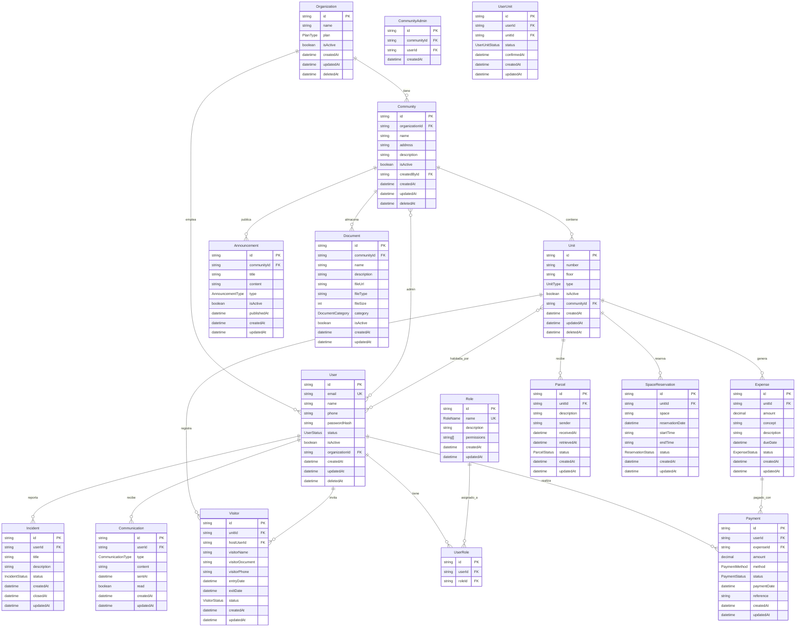

# Diagrama Entidad-Relación - Comuniapp

Este archivo contiene el diagrama ERD de la aplicación Comuniapp en formato Mermaid.

## Cómo Visualizar este Diagrama

### En VS Code:

1. Instala la extensión "Mermaid Preview"
2. Abre este archivo
3. Usa Ctrl+Shift+P y busca "Mermaid: Preview"

### En GitHub:

- Este diagrama se renderizará automáticamente al subirlo a GitHub

### En Mermaid Live Editor:

- Ve a https://mermaid.live/
- Copia y pega el código del diagrama
- Descarga como PNG, SVG o PDF

### En Herramientas Online:

- **Mermaid Chart:** https://www.mermaidchart.com/
- **Diagrams.net:** Importa el código Mermaid

## Información del Diagrama

- **Total de Entidades:** 16 entidades principales
- **Relaciones:** 13 relaciones entre entidades
- **Generado:** Basado en el schema.prisma actual
- **Formato:** Mermaid ERD (Entity Relationship Diagram)
